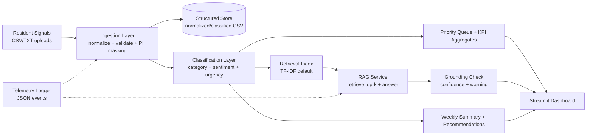
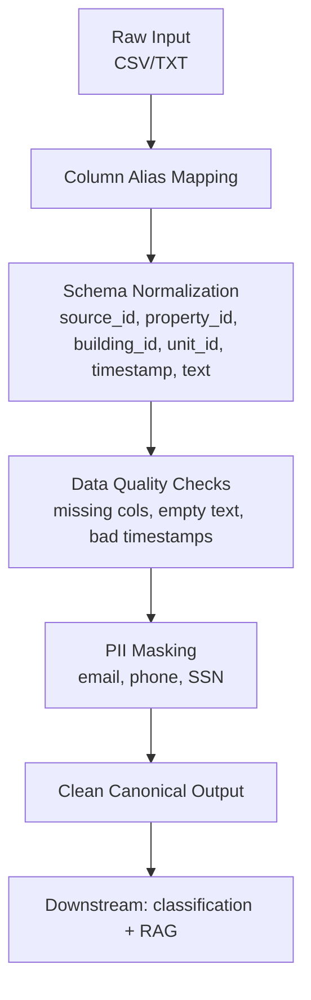
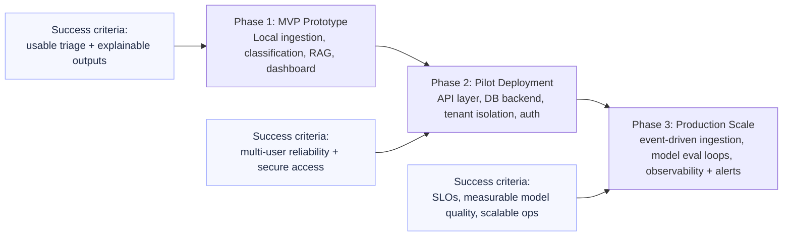

# Resident Experience + Operations Copilot

Local AI system for property/community managers to analyze resident feedback, prioritize operations, and generate recommendations.

## Step-by-step build plan

1. **Project scaffold**
   - Baseline repository structure
   - Streamlit starter app
   - Dependency setup
2. **Data ingestion**
   - Upload CSV/TXT/PDF
   - Normalize into a unified schema
3. **Classification + urgency scoring**
   - Category classifier
   - Sentiment analysis
   - Priority ranking
4. **RAG question answering**
   - Embeddings + vector store
   - Retrieval and grounded response generation
5. **Dashboard + weekly summary**
   - Ops trends, urgent queue, recurring issues
   - Auto-generated manager summary
6. **Hardening (current step)**
   - Logging/metrics
   - Prompt safety + basic PII masking

## Local setup

```bash
python3 -m venv .venv
source .venv/bin/activate
pip install -r requirements.txt
streamlit run app/main.py
```

Run each command on its own line. If you prefer one command, use:

```bash
python3 -m venv .venv && source .venv/bin/activate && pip install -r requirements.txt && streamlit run app/main.py
```

## Step 2 demo

Run the app, then upload `data/sample_resident_feedback.csv`.

The ingestion flow will:
- Load source data
- Normalize to the unified schema
- Show warnings for missing/invalid fields
- Save output to `data/processed/<filename>_normalized.csv`
- Includes `building_id` in normalized output so you can analyze by building/tower

## Step 3 demo

After ingestion, the app now also:
- Classifies each record into an issue category
- Estimates sentiment (positive/neutral/negative)
- Assigns urgency (`low`, `medium`, `high`, `urgent`)
- Ranks records by urgency to create a manager priority queue
- Saves classified output to `data/processed/<filename>_classified_normalized.csv`

## Step 4 demo

The app now includes an "Ask your data" panel that:
- Builds a local retrieval index from classified feedback
- Retrieves top relevant evidence for a manager question
- Returns a grounded answer with recommendations
- Optionally uses local `Ollama` for generated responses
- Falls back to deterministic summarization when no LLM is available

## Step 5 demo

The app now adds operations reporting:
- Auto-generated weekly manager summary paragraph
- Recurring issue detection (repeated complaint patterns)
- Action recommendation list based on urgency, category concentration, and recurrence
- Existing analytics and RAG outputs unified into one manager workflow

## Step 6 demo

Hardening features now included:
- Basic PII masking during ingestion (email, phone, SSN patterns)
- Structured event logging for ingestion and RAG execution
- RAG grounding confidence check with warning for low-evidence answers
- Guardrail behavior that surfaces reliability signals in the UI

Note: for the most stable local demo, keep sentence-transformers embeddings disabled in the UI
and use the default TF-IDF mode unless you specifically want to test transformer embeddings.

## Repository layout

- `app/` Streamlit UI
- `src/` backend logic and pipelines
- `data/` local data (ignored except placeholders)
- `docs/` architecture notes and supplementary diagrams
- `tests/` test suite

## Architecture and design references

High-level diagrams and tables for technical documentation. Render Mermaid in GitHub or VS Code, or export to images as needed.

### System architecture



### Ingestion and privacy pipeline



### Failure modes and mitigations

| Failure mode | Likely cause | Mitigation in current design |
|---|---|---|
| Missing required columns | Inconsistent source schemas | Alias mapping + warnings + null-safe defaults |
| Invalid timestamps | Free-form or bad date formats | `to_datetime(..., errors="coerce")` + warning count |
| Empty/non-actionable rows | Blank feedback submissions | Drop empty text rows before downstream processing |
| PII leakage risk | Raw resident text may include personal data | Regex masking for email/phone/SSN at ingestion |
| Embedding dependency issues | Optional heavy libs unavailable locally | TF-IDF default fallback; opt-in transformer embeddings |
| LLM unavailable/offline | Ollama/model not installed | Deterministic fallback summary response |
| Potential hallucination | Generated text not grounded enough | Retrieval evidence table + grounding confidence warning |

### Design tradeoffs

| Decision area | Chosen for MVP | Why this choice | Tradeoff accepted | Production evolution |
|---|---|---|---|---|
| App framework | Streamlit | Fast end-to-end demo and iteration | Less control than custom frontend | Move to React/Next.js + API |
| Retrieval engine | TF-IDF default | Stable local setup, zero model bootstrap | Lower semantic recall vs embeddings | Add robust embedding service |
| Classification logic | Rules + keyword heuristics | Transparent and easy to debug | Limited nuance/recall | Supervised model + eval pipeline |
| Storage approach | Local CSV outputs | Simple and portable for interview | Weak concurrency/querying | PostgreSQL + pgvector |
| Generation layer | Optional Ollama | Offline/local narrative generation | Model quality depends on local setup | Managed model endpoint + guardrails |
| Reliability approach | Fallbacks + warnings | Demo resilience under failures | Not full SLO monitoring stack | Metrics, alerting, and tracing |

### MVP to production roadmap


